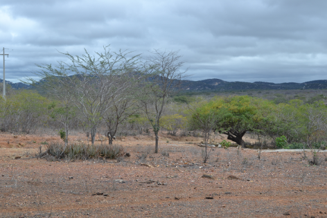
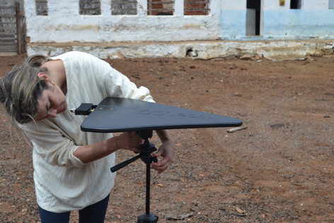
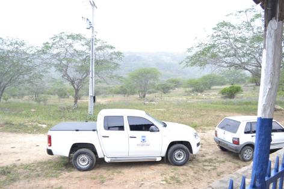
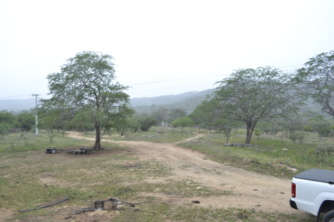
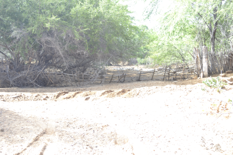
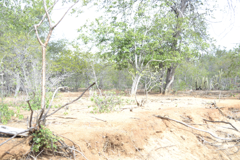
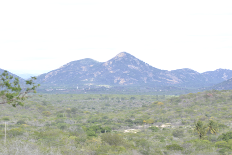
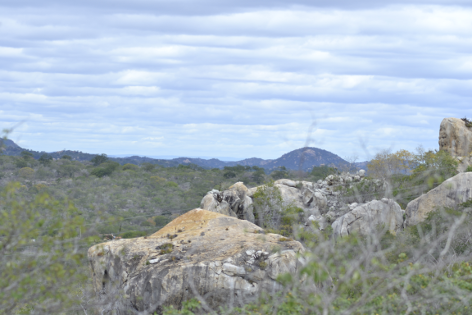

```{r, echo=FALSE, results='hide', warning=FALSE, message=FALSE}
source("./cariri.R")
source("./caririData.R")
```

# Abstract

In the following we describe the methods and results for the second BINGO expedition in Paraíba - Brasil. We visited 4 sites in a region called CARIRI. The site choosing was carried on with a computational approach followed by the reality check got from the in site experience. Site choosing method is documented in https://github.com/lbarosi/BINGO, we present the specific methodology used in the measurements of RFI in the 900 - 1300Mhz band, information from the region including photos and detailed maps and we present the raw data in the end, with some minor analisys.


# Equipment

Equipment | Model | Spec
----------|-------|-----|
Spectrum Analyzer |Agilent N9912A |MY51464286 |
Discone | INPE manufactured| |
Antena Log Periodic | | 800-900-1800-1900Mhz 15dB|
Active Log-Periodic Antenna |Shure | 35dB |
Multimeter | Fluke 87 | RMS multimeter | 
LNA | KU LNA 1090A - 841 | |

# Measuring the Signal

We primarily intended to apply the following procedure:
1. Set RBW to 300Mhz in Spectrum Analyzer.
2. Take 10 minutes of continuous measurement with discone connected.
3. Take 90s of continous measuremente with log antenna connected, in four different directions.

However, spectrum analyzer firmware did not allowed to record continous measurements. After considering the available recording modes the following procedure was implemented:
1. Set RBW to 300 Mhz
2. Take 1 minute of continous measurement with the analyser in average mode, record and repeat over till 10 times, with disconne connected in a pole.
3. Take 15s of continous measurements with average mode, record and repeat over 9 times with an active log antenna connected with a 35dB LNA. Repeat for 4 cardinal points.

## Campaign Maps

The following map depicts the region visited. The small red crossed indicate known ERBs, the orange (and yellow) crossmarks indicate points likely to have low signal, as analysed in a computer procedure.

Calculating the likely sites position was done considering distance from ERBs on sigth only, using information from the elevation of each point to discard the offsight antenna. In this model we used an ad hoc -66 threshold, the same level calculated for previous sites in the first campaign.

We decided to measure two points in each side of the main road BR302.

```{r, results='hold', message=FALSE, echo=FALSE, warning=FALSE, fig.width=8, fig.align='center', fig.asp=0.73}
sitiosZoomCariri(33,0.3,25)
```

```{r, results='hold', message=FALSE, echo=FALSE, warning=FALSE, fig.width=8, fig.align='center', fig.asp=0.73}
pontoCariri(33,11)
```

\newpage

## Measurement 1

```{r, results='hold', message=FALSE, echo=FALSE, warning=FALSE, fig.width=3.5}
sitiosZoomCariri(17,0.1,25)
pontoCariri(17,15)
```


### Geolocation

Lat | Lon | Elev|  Ruído | 
-------|-----------|----------|------------|
`r silencioCariri$lat[17]` | `r silencioCariri$lon[17]` | 557m |`r silencioCariri$Ruido[17]` |

### Observations:

1. Easy access.
2. Region of small propertyes dedicated to livestock.
3. Rural mobile cell signal reported.




## Measurement 2

```{r, results='hold', message=FALSE, echo=FALSE, warning=FALSE, fig.width=3.5}
sitiosZoomCariri(2,0.1,25)
pontoCariri(2,15)
```

### Geolocation

Lat | Lon | Elev|  Ruído | 
-------|-----------|----------|------------|
`r silencioCariri$lat[2]` | `r silencioCariri$lon[2]` | 596m |`r silencioCariri$Ruido[2]` |


### Observations:

1. Protected region 5.000 he.
2. Strong support from local manager.




## Measurement 3

```{r, results='hold', message=FALSE, echo=FALSE, warning=FALSE, fig.width=3.5}
sitiosZoomCariri(3,0.1,25)
pontoCariri(3,15)
```

### Geolocation

Lat | Lon | Elev|  Ruído | 
-------|-----------|----------|------------|
`r silencioCariri$lat[3]` | `r silencioCariri$lon[3]` | 481m |`r silencioCariri$Ruido[3]` |

### Observations:


1. Easily accesible
2. Some houses in the neibourghood
3. Measures taken in a dried river.
4. Faint signal detected near 1.2 GHz. Under further inspection we found a member of the team has forgotten to turn his cell off.




## Measurement 4


```{r, results='hold', message=FALSE, echo=FALSE, warning=FALSE, fig.width=3.5}
sitiosZoomCariri(41,0.1,25)
pontoCariri(41,15)
```

### Geolocation

Lat | Lon | Elev|  Ruído | 
-------|-----------|----------|------------|
`r silencioCariri$lat[41]` | `r silencioCariri$lon[41]` |  |`r silencioCariri$Ruido[41]` |

### Observations:

1. Very difficult access (4x4)
2. It was too difficult to get to the point of interest. Measuments were taken where we could, with a city in the line of sight, altough no ERBs were visible with a moderate zoom.
3. Signals detected with various shapes and frequencies.
4. Due to time constraints it was not possible to measure using the discone.




# Results

We concatenated all the measurements for each site, antenna and direction. We then calculated the 10% and 90% quantile and the median of the data. We obtained the following graphs. We subtracted the median from the 90% signal to reduce the noise and then chose to plot the spectra in Energy coordinates so as to make any signal more visible from the average noise. (We defined Energy Coordinates as $P = 10^(I/20)$, where P is the power and I is the intensity measured in dBm)

UNfortunately the measurements didn't all take the same procedures and we decided to join all data sets for every site, from the discone and from the directional antenna. (The raw data are available in the folder Experimentos in the GitHUb)

We then plot the 90% level converted to the Energy scale for all the sites

```{r, results='hold', message=FALSE, echo=FALSE, warning=FALSE, fig.width=7}
plotaSites90(site01,site02,site03,site04,900)
```

and we can also plot the diference level 90% - median

```{r, results='hold', message=FALSE, echo=FALSE, warning=FALSE, fig.width=7}
plotaSitesDelta(site01,site02,site03,site04,900)
```

Above we chose to plot only the 900 - 1200 Mhz window, though some data was acquired outside this windows and consequently interfered with the analysis, as can be seen in thw graphics below, the same graphics for the whole frequency interval

```{r, results='hold', message=FALSE, echo=FALSE, warning=FALSE, fig.width=3.5}
plotaSites90(site01,site02,site03,site04,0)
plotaSitesDelta(site01,site02,site03,site04,0)
```

By looking at this graphics we can conclude:

1. Site 1 shows signal above 1200Mhz. Even though it does not strike as a particular silent point, is's very to acess the region. The fact that all propertioes nearby are small private properties may turn negotiation for land use a bit complicated.
2. Site 2 seems to show a clean spectrum. The acess is easy and there is interest from the manager of the farm, which is a conservation unit. It's clear that some kind of quid pro quo is needed.
3. Site 3 measurements are compromised due to change in frequency range and a cell phone turned on. 
4. There is a clear 945Mhz signal in site 4, which otherwise presents a very flat spectrum. We stringly believe that going no more than 1 km further we may find a clean site. However the access to the place is not easy, 4x4 vehycle is needed. 

In the file caririData.R one can find different functions to plot the data, which are self-explanatory.