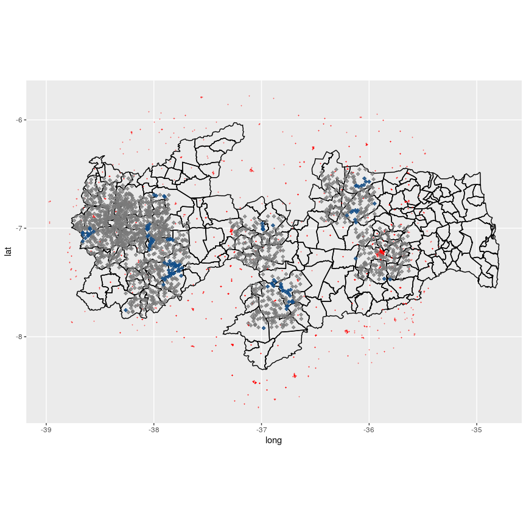
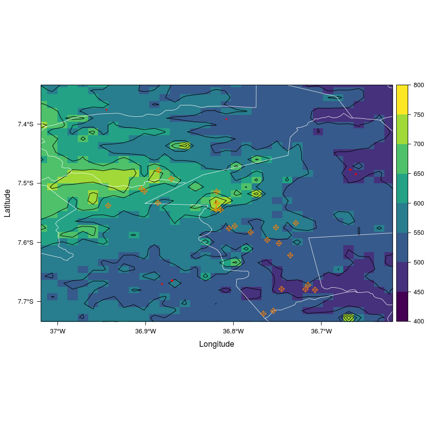
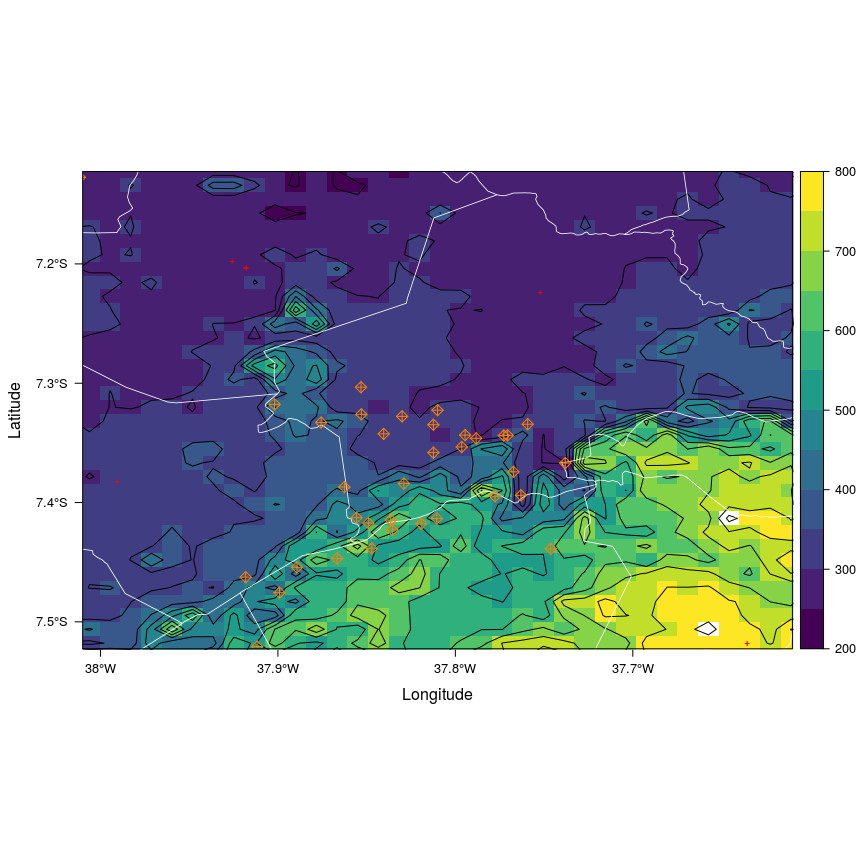
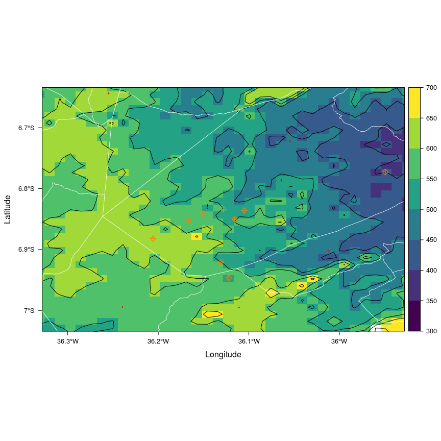
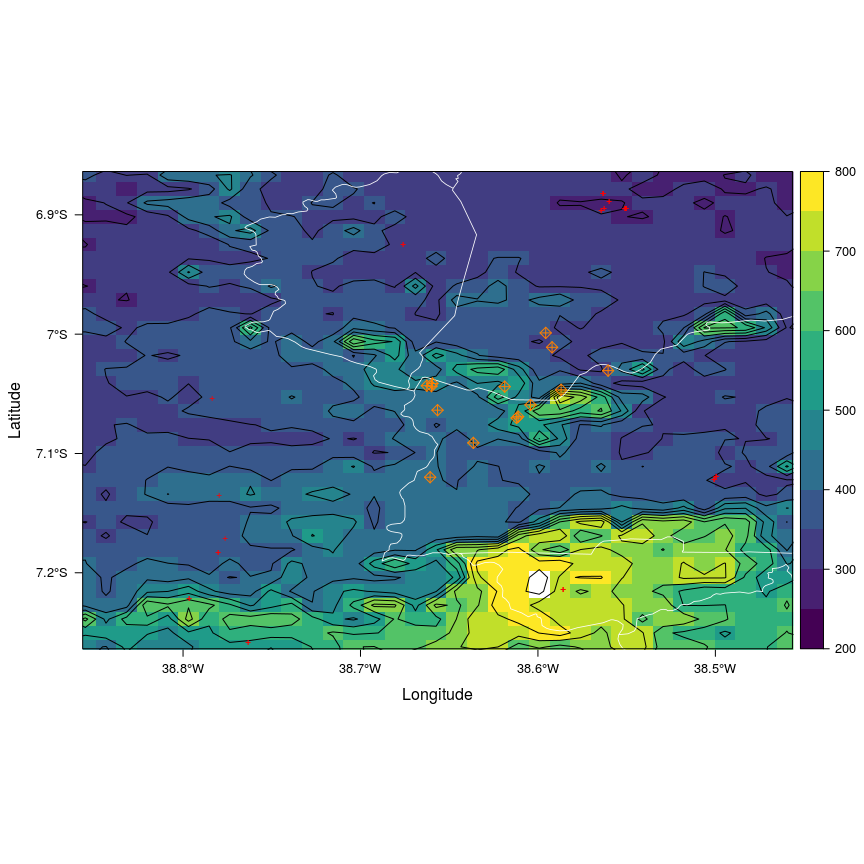

Working with Spatial Data in R: Am Example
================
Luciano Barosi
30 de junho de 2017

-   [The Result](#the-result)
    -   [Zoom in](#zoom-in)
        -   [Serra Branca](#serra-branca)
        -   [OLho D'água](#olho-dagua)
        -   [São José de Piranhas](#sao-jose-de-piranhas)
        -   [Barra de Santa Rosa](#barra-de-santa-rosa)
        -   [São José de Piranhas](#sao-jose-de-piranhas-1)
-   [Introduction](#introduction)
-   [R libraries](#r-libraries)
-   [The Data](#the-data)
-   [Functions](#functions)
    -   [Auxiliary Functions](#auxiliary-functions)
    -   [Main Signal function](#main-signal-function)
    -   [Packing all together](#packing-all-together)
-   [A little bit of massage for the data](#a-little-bit-of-massage-for-the-data)
-   [Visualization](#visualization)

    ## Shapefile type: Polygon, (5), # of Shapes: 223

The Result
==========

Below you can see a maP from Paraiba-Brasil, the county limits, red dots indicating base stations for mobile communication, blue crosses indicating points with very low signal and gray crosses indicating sample points.

Zoom in
-------

We can zoom in to see the levelplot for each point. We show terrain, base stations and the selected point in the center. Any nearby point is also shown.

### Serra Branca

### OLho D'água

### São José de Piranhas

### Barra de Santa Rosa

### São José de Piranhas

Below you'll see how I made this.

Introduction
============

R is a very powerful tool to work with large amounts of data and, in particular, to work with Spatial Data. There are inumerous tools to deal with it for visualization and also for computation.

Here we set a problem for Study:

> How to find coordinates with no mobile coverage in a particular brazilian state.

We need to define what we mean for this question.

Mobile communication are provided by stations spread in the territory. In the frequency of operation (1 Ghz), the propagation occurs essentialy by two means: line of sight propagation and reflection. The 20cm wavelength doesn't allow for useful refraction in hills and other topographical accidents. Reflaction is meaningful in urban areas with lots of concrete buildings but is not expected to be relevant in open field, due to vegetation.

The path loss for one antenna cam be calculated using the Friss model:

$$P = 20 \\mathrm{log}\_{10} \\left(\\frac{4 \\pi d}{\\lambda} \\right)$$

Our method will be:

> Sample same region with random coordinates, for each point we will determine the neighbouring stations, check which of these are in the line of sight of the points (with altitude data), then we take the nearest station and calculate the path loss.

R libraries
===========

    #Libraries
    library(readxl)     #read_excel function
    library(dplyr)      #Lotś of useful stuff: ddply, select, filter, mutate...
    library(magrittr)   # Piping is cool
    library(reshape2)
    library(tictoc)     # Benchmark
    library(sp)         # SpatialPolygons
    library(raster)
    library(latticeExtra)
    library(lattice)
    library(leaflet)    # Cool interative open street maps
    library(rasterVis)  # Levelplot
    library(viridis)    # Nice coloring schemes
    library(rgdal)      # readOGR function
    library(maptools)
    library(geosphere)
    library(rgeos)
    library(ggmap)      # function geocode()

The Data
========

The shapefiles can be read with rgdal::readOGR function and should all be projected to a appropriate and consistent projection. Usually ths means to use sp:spTransform function and the WGS84 projection. All these objects can be acessed easily and can be converted bach and forth to dataframes. (use coordinates(dataframe) to retrieve the SpatialObject)

You can read shapefiles with maptools::readShapePoly also.

The geoTIFF object should be read by raster::raster function. These objects can be manipulated as dataframes, as in the merge example below.

    # County limits of Paraiba, Brasil
    # OBtained in http://acervofundiario.incra.gov.br/i3geo/ogc/index.php#
    #These are shapefiles SHP

    P4S.latlon <- CRS("+proj=longlat +datum=WGS84")
    hrr.shp <- readShapePoly("./GEODATA/municipiosPB/i3geomap_municipios_pb", verbose=TRUE, proj4string=P4S.latlon) 

    municipios <- readOGR("./GEODATA/municipiosPB","i3geomap_municipios_pb", verbose = FALSE)
    municipios <- spTransform(municipios, CRS("+proj=longlat +datum=WGS84"))

    #Data from private and public properties

    #Malha de Glebas Federais
    glebasFederais <- readOGR("./GEODATA/glebasfederais","i3geomap_glebas_federais", verbose = FALSE)
    glebasFederais <- spTransform(glebasFederais, CRS("+proj=longlat +datum=WGS84"))
    #Malha de Imóveis públicos da Paraíba
    imoveisPublicosPB <- readOGR("./GEODATA/publicoPB","i3geomap_imoveiscertificados_publico_pb", verbose = FALSE)
    imoveisPublicosPB <- spTransform(imoveisPublicosPB, CRS("+proj=longlat +datum=WGS84"))
    #Malha de Imóveis públicos da Paraíba SIGEF
    imoveisPublicosPB2 <- readOGR("./GEODATA/sigefPublicoPB","i3geomap_certificada_sigef_publico_pb", verbose = FALSE)
    imoveisPublicosPB2 <- spTransform(imoveisPublicosPB2, CRS("+proj=longlat +datum=WGS84"))
    #Malha de Imóveis Particulares PB
    imoveisParticularesPB <- readOGR("./GEODATA/privadosPB","i3geomap_imoveiscertificados_privado_pb", verbose = FALSE)
    imoveisParticularesPB <- spTransform(imoveisParticularesPB, CRS("+proj=longlat +datum=WGS84"))
    #Malha de Imóveis Particulares PB SIGEF
    imoveisParticularesPB2 <- readOGR("./GEODATA/particularPB","i3geomap_certificada_sigef_particular_pb", verbose = FALSE)
    imoveisParticularesPB2 <- spTransform(imoveisParticularesPB2, CRS("+proj=longlat +datum=WGS84"))

    #Data from Conservation Units (Public and Private)
    #Malha de Unidades de Conservação
    UCs <- readOGR("./GEODATA/UCs","UCs_fed_junho_2017", verbose = FALSE)
    UCs <- spTransform(UCs, CRS("+proj=longlat +datum=WGS84"))
    #Malha de RPPNs
    RPPNs <- readOGR("./GEODATA/RPPN","PB", verbose = FALSE)
    RPPNs <- spTransform(RPPNs, CRS("+proj=longlat +datum=WGS84"))

    # Data for elevation from the site below
    ##https://www.cnpm.embrapa.br/projetos/relevobr/download/
    # These are geoTIFF files

    MAP1 <- raster("./GEODATA/sb-24-z-a/SB-24-Z-A.tif")
    MAP2 <- raster("./GEODATA/sb-24-z-c/SB-24-Z-C.tif")
    MAP3 <- raster("./GEODATA/sb-24-z-d/SB-24-Z-D.tif")
    MAP4 <- raster("./GEODATA/sb-24-z-b/SB-24-Z-B.tif")
    MAP5 <- raster("./GEODATA/sb-25-y-c/SB-25-Y-C.tif")
    MAP6 <- raster("./GEODATA/sb-25-y-a/SB-25-Y-A.tif")
    MAP7 <- raster("./GEODATA/sc-24-x-b/SC-24-X-B.tif")
    Paraiba <- merge(MAP1, MAP2, MAP3, MAP4, MAP5, MAP6, MAP7)

    # Coordinates for Base Stations
    #Antenas
    #Retrieved from http://www.coberturacelular.com.br/
    ERBs <- read_excel("./DATA/ERBs.xlsx")
    ERBs$Latitude %<>% as.numeric(.)
    ERBs$Longitude %<>% as.numeric(.)
    #ERBs %<>% filter(., Latitude > ymin & Latitude < ymax & Longitude > xmin & Longitude < xmax  )
    ERBs %<>% unique()

There is also a few more auxiliary data from air traffic. sp::splines function transform them into Spatial objects with a definite projection.

    #retrieved from http://www.aisweb.aer.mil.br/
    #AEREOS H3 e V3 aisweb 2016
    AEREOS            <- read_excel("./DATA/AEREOvisited.xlsx")
    #Sitios de Interesse Selecionados
    sites             <- read_excel("./DATA/sitesvisited.xlsx")
    nomes             <- sites$NOME

    #Sites Aleatorios calculados
    #silencio          <- read.csv("./silencio.csv")
    #coordinates(sites) <- c("lon","lat")
    #Linhas Aereas H3 e V3-------------------------------------------------------------
    linha1 <- AEREOS %>% filter(., NOME %in% c("BANGU", "OPABA"))  %>% as.data.frame()
    linha2 <- AEREOS %>% filter(., NOME %in% c("BANGU", "EDITE")) %>% as.data.frame()
    linha3 <- AEREOS %>% filter(., NOME %in% c("LOMOK", "OPSUS")) %>% as.data.frame()
    linha4 <- AEREOS %>% filter(., NOME %in% c("BANGU", "ILNOT")) %>% as.data.frame()
    linha5 <- AEREOS %>% filter(., NOME %in% c("VACAR", "ISUKU")) %>% as.data.frame()

    l1 <- linha1 %>% select(., lon, lat) %>% as.matrix %>% spLines(., crs='+proj=longlat +datum=WGS84')
    l2 <- linha2 %>% select(., lon, lat) %>% as.matrix %>% spLines(., crs='+proj=longlat +datum=WGS84')
    l3 <- linha3 %>% select(., lon, lat) %>% as.matrix %>% spLines(., crs='+proj=longlat +datum=WGS84')
    l4 <- linha4 %>% select(., lon, lat) %>% as.matrix %>% spLines(., crs='+proj=longlat +datum=WGS84')
    l5 <- linha5 %>% select(., lon, lat) %>% as.matrix %>% spLines(., crs='+proj=longlat +datum=WGS84')

Functions
=========

Auxiliary Functions
-------------------

If we have the coordinates of a point and a base station, we use geosphere::disGEO to calculate the geodesic distance between then. The output in meters can then be used to caculate the Friss attenuation. Here we made the assumption that the base station operates at 50dBm level. We exclude points to near to the antenna, since reflection can be relevant in this case.

    pathLoss    <- function(ponto,erb) {
      # PathLoss em linha reta no ar - Friss Model  
      dist  <- distGeo(ponto,erb)
      #Assume Potencia da Antena de 50dBm
      #Se muito perto da antena, 0
      path  <- ifelse(dist>=1000,-20*log10(4*pi*dist/0.21)+50, 0)
      
      return(path) 
    }

We should only worry about antennas in the line of sight. So we should check if there's a obstacle between the site and the antenna, in which case we can exclude the antenna from our concerns.

The relevant functions to use are: 1. geosphere:gcIntermediate, which retrieves *n* points in the geodesic from point 1 to point 2. This function returns a list that can be turned into a dataframe. 2. raster:extract(RASTER,SpatialObject), return properties of the raster. In this case we provide raster:SpatialPoints converts Lat,lon point into a SpatialPoint and we feed to extract. Extract finds the cell that contain the point and returns the attribute as a SpatialObject. We convert it to a dataframe.

We construct the geodesics with 60 points (58 intermediate points). SInce we are looking for stations less than 50km apart from the object (otherwise they are irrelevant anyway) we are considering sampling points somewhat less than 1 km apart. Nevertheless, for nearby stations, 60 points sample can acess many points for which the raster has no value, since satellite coverage isn't smooth and complete along the raster. We fix this by completing the possibly NA values with the mean data along the geodesics.

Of course a much better approach would be to use raster::interpolate function with some appropriate model for fitting. But this approach would slow down the performance, and we want to calculate a large sample of data.

    retaGeod    <- function(ponto,erb){
      #Função determina geodésica com 10 pontos e retorna as altitudes dos pontos  
      pontos      <- gcIntermediate(ponto, erb, n=48, addStartEnd=TRUE) %>% as.data.frame()
      alt         <- sapply(c(1:50), function(x) {
        pontos[x,] %>% SpatialPoints() %>% extract(Paraiba,.)
      }) %>% as.data.frame() # Extrai dados de Altura
      
      names(alt)  <- c("z")
      #Valores de células vazias
      alt[is.na(alt)] <- mean(alt$z, na.rm = TRUE)
      ##########################
      pontos      <- cbind(pontos, alt) %>% as.data.frame()
      pontos      %<>% filter(., !is.na(z)) #Retorna apenas antenas com informação
      
      return(pontos)
      
    }

The function above returns the list of intermediate points. To verify if the antenna is in the line of fight or not we considerar the straitgh line from site to antenna, we subtract these values from the heights obtained in retaGeod and we further subtract 50m. In total, we consider an antenna not to be in line of sight if there an obstacle bigger than 50m in the straigth line from antenna to site.

    lineOfsight <- function(ponto,erb){
      data <- retaGeod(ponto,erb)
      nL <- length(data$z)
      hmin <- data[1,3]
      k    <- (data[nL,3]-data[1,3])/nL
      data$n <- c(1:nL)
      data1 <- mutate(data, hadj = z-k*(n-1)/nL-50-hmin)
      boole <- max(data1[[5]][2:nL]) < 0
      return(boole)
    }

In the functions below we determine which of the stations from the list are on sight, Signal function calls other functions to get the attenuation for each point. Finally we construct verificaSitios to take a dataframe with (lon,lat) and calculate the signals to all of them.

    erbsOnsight <- function(ponto){
      erbs    <- ERBs
      erbs    %<>% select(., Longitude, Latitude)
      erbsD   <- mutate(erbs, Dist = distGeo(ponto, erbs), Boole = lineOfsight(ponto,erbs))
      erbsD   <- erbsD %>% arrange(Dist) %>% filter(., Dist < 30000) %>% filter(.,Boole == TRUE)
      
      ifelse(length(erbsD$Boole)>0, return(erbsD), return(FALSE))
      #return(erbsD)
    }

Main Signal function
--------------------

    #------------------------------------------------
    Signal <- function(ponto){

      vazioDF           <- c(-100,0,100) %>% t() %>% as.data.frame()
      names(vazioDF)    <- c("Ruído", "N. Estações", "Distância min")
      
      #Function Body 
      erbs              <- erbsOnsight(ponto)
      
      flag <- ifelse(erbs == FALSE,return(vazioDF),1)
      
        erbsPOS         <- select(erbs, Longitude, Latitude)
        erbsPOS         <- mutate(erbsPOS, Ruido = pathLoss(ponto,erbsPOS), 
                                  Dist = distGeo(ponto,erbsPOS))
        nois            <- c(max(erbsPOS$Ruido),length(erbsPOS$Dist),min(erbsPOS$Dist)) %>%
          t() %>% as.data.frame()
        names(nois)    <- c("Ruído", "N. Estações", "Distância min")
        return(nois)
      
    }
    #-------------------------------------------------
     verificaSitios <- function(df){
     
       sitios    <- select(df, lon, lat)
     
       noise     <- sapply(c(1:length(sitios$lon)), function(x) {
                                         Signal(sitios[x,])
                                         }) %>% 
                                     t() %>% as.data.frame()
       noise$Ruído           %<>% as.numeric()
       noise$`N. Estações`   %<>% as.numeric()
       noise$`Distância min` %<>% as.numeric()
       
       noise <- cbind(df, noise)
       
       return(noise)
       
     }

Packing all together
--------------------

We combine all of the previous functions into a function appropriate to the random sampling. We could have used geosphere::randomCoordinates with some adaptation, but Paraiba is small enough for us to consider using just runif function. We don't mind with the quality of our randomness, we care about find some points with low signal.

We use the very useful function raster::over, it tests it the point is inside some SpatialPolygon and we can access the properties of raster data for this polygon.

    randomSitios <- function(n,xmin,xmax,ymin,ymax,seed,name){
      set.seed(seed)
      lat <- runif(n,ymin,ymax)
      lon <- runif(n,xmin,xmax)
      RandomSites <- cbind(lon,lat) %>% as.data.frame()
      
      coordinates(RandomSites) <- c("lon","lat")
      proj4string(RandomSites) <- proj4string(municipios)
      RandomSites$mun <- over(RandomSites,municipios)$NOME_MUN1

      RandomSites <- as.data.frame(RandomSites) %>% filter(.,!is.na(mun))
      
      noiseRandom <- verificaSitios(RandomSites)  
      
      coordinates(noiseRandom) <- c("lon","lat")
      proj4string(noiseRandom) <- proj4string(municipios)
      noiseRandom$mun <- over(noiseRandom,municipios)$NOME_MUN1 %>% as.data.frame()
      

      write.csv(noiseRandom,name, row.names = FALSE)
        
      
      return(as.data.frame(noiseRandom))
    }

In order to call this function orderly, we define some seed, number of points and the side of the square to be sampled. Half a degree represents 120km. So we choose 0.25 degrees as half the side of our square.

    seed  <- 11
    n     <- 200
    delta <- 0.25 #Raio de 120km

Choose some locations. We use ggmap::geocode function. This is very convenient but has the Google API limitatios, you need to accept the terms and you have a fixed number of requests per day. Needless to say, you have to be online!

    cajazeiras      <- geocode("Cajazeiras Paraiba Brasil")
    CampinaGrande   <- geocode("Cajazeiras Paraiba Brasil")
    Sossego         <- geocode("Sossego Paraiba Brasil")
    Sume            <- geocode("Sume Paraiba Brasil")
    Passagem        <- geocode("Passagem Paraiba Brasil")
    Pianco          <- geocode("Pianco Paraiba Brasil")
    Balanca         <- geocode("Balanca Paraiba Brasil")
    SJTapada        <- geocode("São José da Lagoa Tapada Paraiba Brasil")
    SJPeixe         <- geocode("São João do Rio do Peixe Paraiba Brasil")
    SJPiranhas      <- geocode("São Jose de Piranhas Paraiba Brasil")

We sample around these points, with a reproducible seed. It's going to be a long calculation, doesn't hurt to do some benchmarking with tictoc package

    tic()
    Rcajazeiras      <- randomSitios(n,cajazeiras[[1]]-delta,cajazeiras[[1]]+delta,
                                       cajazeiras[[2]]-delta,cajazeiras[[2]]+delta,seed,
                                     "./RandomSites/Rcajazeiras.csv")
    #-------------------------------------
    RCampinaGrande   <- randomSitios(n,CampinaGrande[[1]]-delta,CampinaGrande[[1]]+delta,
                                     CampinaGrande[[2]]-delta,CampinaGrande[[2]]+delta,seed,
                                     "./RandomSites/CampinaGrande.csv")
    RSossego         <- randomSitios(n,Sossego[[1]]-delta,Sossego[[1]]+delta,
                                     Sossego[[2]]-delta,Sossego[[2]]+delta,seed,
                                     "./RandomSites/Sossego.csv")
    RSume            <- randomSitios(n,Sume[[1]]-delta,Sume[[1]]+delta,
                                     Sume[[2]]-delta,Sume[[2]]+delta,seed,
                                     "./RandomSites/Sume.csv")
    RPassagem        <- randomSitios(n,Passagem[[1]]-delta,Passagem[[1]]+delta,
                                   Passagem[[2]]-delta,Passagem[[2]]+delta,seed,
                                     "./RandomSites/Passagem.csv")
    RPianco          <- randomSitios(n,Pianco[[1]]-delta,Pianco[[1]]+delta,
                                     Pianco[[2]]-delta,Pianco[[2]]+delta,seed,
                                   "./RandomSites/Pianco.csv")
    RBalanca         <- randomSitios(n,Balanca[[1]]-delta,Balanca[[1]]+delta,
                                     Balanca[[2]]-delta,Balanca[[2]]+delta,seed,
                                     "./RandomSites/Balanca.csv")
    RSJTapada        <- randomSitios(n,SJTapada[[1]]-delta,SJTapada[[1]]+delta,
                                     SJTapada[[2]]-delta,SJTapada[[2]]+delta,seed,
                                     "./RandomSites/SJTapada.csv")
    RSPeixe          <- randomSitios(n,SJPeixe[[1]]-delta,SJPeixe[[1]]+delta,
                                   SJPeixe[[2]]-delta,SJPeixe[[2]]+delta,seed,
                                     "./RandomSites/SJPeixe.csv")
    RSPiranhas       <- randomSitios(n,SJPiranhas[[1]]-delta,SJPiranhas[[1]]+delta,
                                     SJPiranhas[[2]]-delta,SJPiranhas[[2]]+delta,seed,
                                   "./RandomSites/SJPiranhas.csv")
    exectime <- toc()
    Signaltime <- exectime$toc - exectime$toc

So much for coding. This computation takes approx 3h for me. Let's move on.

A little bit of massage for the data
====================================

After running randomSitios you will end up with the ./RandomSites directory with some files. We loaded it and filter the silent sites (Attenuation &lt; -67, comparing the numbers with known silent points in the field)

    #Carrega todos os arquivos em ./RandomSites
    files       <- list.files("./RandomSites") 
    sitios      <- lapply(files, function(i) {
                            name <- paste("./RandomSites/",i,sep="");
                            read.csv(name)
                            })
    sitios      <- do.call(rbind,sitios) %>% as.data.frame()

    silencio    <- sitios %>% filter(., Ruído < -67)

We can add informations from the shapefiles to know if we have some information about the land (owners). Again we use the handy function over from raster package. Far enough is considerer to be 10km.

    coordinates(silencio) <- c("lon","lat")
    proj4string(silencio) <- proj4string(municipios)
    silencio$Particular1  <- over(silencio,imoveisParticularesPB)$NOME_IMO9
    silencio$Particular2  <- over(silencio,imoveisParticularesPB2)$NOME_ARE9
    silencio$Publico1     <- over(silencio,imoveisPublicosPB)$NOME_IMO9
    silencio$Publico2     <- over(silencio,imoveisPublicosPB2)$NOME_ARE9
    silencio$UCs          <- over(silencio,UCs)$nome

We also wnat sites far from air routes. We can use the function geosphere::dis2Line

    silencio$AEREO1         <- dist2Line(silencio,l1) %>% as.data.frame() %>% select(., distance)
    silencio$AEREO2         <- dist2Line(silencio,l2) %>% as.data.frame() %>% select(., distance)
    silencio$AEREO3         <- dist2Line(silencio,l3) %>% as.data.frame() %>% select(., distance)
    silencio$AEREO4         <- dist2Line(silencio,l4) %>% as.data.frame() %>% select(., distance)
    silencio$AEREO5         <- dist2Line(silencio,l5) %>% as.data.frame() %>% select(., distance)

    silencio %<>% as.data.frame()
    names(silencio) <- c("Mun","lon", "lat", "Ruido", "Antenas", "Dmin", "Opt", 
                         "Part1", "Part2", "Publ1", "Publ2", "UCs", "AEREO1",
                         "AEREO2", "AEREO3", "AEREO4","AEREO5")
                         

    silencio <- silencio %>% as.data.frame() %>%
      mutate(., AEREO = pmin(AEREO1, AEREO2, AEREO3, AEREO4, AEREO5)) %>%
      select(., -AEREO1,-AEREO2, -AEREO3, -AEREO4,-AEREO5)

    silencio %<>% filter(., AEREO > 10000)

Visualization
=============

Let's visualize what we have got. We cam use a leaflet::leaflet plot to get an interactive openstreetmap with some layers. We are adding the basestations, the air lines, and the randomsites layered with the county mesh:

    #Visualização Geral de sites 
    leaflet() %>% addTiles(group = "OSM (default)") %>% 
      setView(lng = -37.55, lat = -6.97, zoom = 9) %>%
      addCircles(lng = sitios$lon, lat = sitios$lat, radius = 40, 
                 label = sitios$mun, color = "purple", group = "sites") %>%
      addCircles(lng = ERBs$Longitude, lat = ERBs$Latitude, weight = 3, radius=40, 
                 color="firebrick", stroke = TRUE, fillOpacity = 0.4, group = "ERBs") %>%
      addPolygons(data = municipios, col="white" , weight = 2, fill = FALSE, label = municipios$NOME_MUN1, 
                  group = "County limits") %>%
                   addPolylines(lng = linha1$lon, linha1$lat, dashArray = "5, 5, 1, 5" ,opacity = 1, weight = 2, 
                   color = "goldenrod", group = "Air Traffic") %>%
      addPolylines(lng = linha2$lon, linha2$lat, dashArray = "5, 5, 1, 5" ,opacity = 1, weight = 2, 
                   color = "goldenrod", group = "Air Traffic") %>%
      addPolylines(lng = linha3$lon, linha3$lat, dashArray = "5, 5, 1, 5" ,opacity = 1, weight = 2, 
                   color = "goldenrod", group = "Air Traffic") %>%
      addPolylines(lng = linha4$lon, linha4$lat, dashArray = "5, 5, 1, 5" ,opacity = 1, weight = 2, 
                   color = "goldenrod", group = "Air Traffic") %>% 
      addPolylines(lng = linha5$lon, linha5$lat, dashArray = "5, 5, 1, 5" ,opacity = 1, weight = 2, 
                   color = "goldenrod", group = "Air Traffic") %>%
      addScaleBar()

Include the "silence points"

    #Visualização Geral de sites 
    leaflet() %>% addTiles(group = "OSM (default)") %>% 
      setView(lng = -37.55, lat = -6.97, zoom = 9) %>%
      addCircles(lng = silencio$lon, lat = silencio$lat, radius = 5000, 
                 label = silencio$mun, color = "green", group = "sites") %>%
      addCircles(lng = sitios$lon, lat = sitios$lat, radius = 40, 
                 label = sitios$mun, color = "purple", group = "sites") %>%
      addCircles(lng = ERBs$Longitude, lat = ERBs$Latitude, weight = 3, radius=40, 
                 color="firebrick", stroke = TRUE, fillOpacity = 0.4, group = "ERBs") %>%
      addPolygons(data = municipios, col="white" , weight = 2, fill = FALSE, label = municipios$NOME_MUN1, 
                  group = "County limits") %>%
                   addPolylines(lng = linha1$lon, linha1$lat, dashArray = "5, 5, 1, 5" ,opacity = 1, weight = 2, 
                   color = "goldenrod", group = "Air Traffic") %>%
      addPolylines(lng = linha2$lon, linha2$lat, dashArray = "5, 5, 1, 5" ,opacity = 1, weight = 2, 
                   color = "goldenrod", group = "Air Traffic") %>%
      addPolylines(lng = linha3$lon, linha3$lat, dashArray = "5, 5, 1, 5" ,opacity = 1, weight = 2, 
                   color = "goldenrod", group = "Air Traffic") %>%
      addPolylines(lng = linha4$lon, linha4$lat, dashArray = "5, 5, 1, 5" ,opacity = 1, weight = 2, 
                   color = "goldenrod", group = "Air Traffic") %>% 
      addPolylines(lng = linha5$lon, linha5$lat, dashArray = "5, 5, 1, 5" ,opacity = 1, weight = 2, 
                   color = "goldenrod", group = "Air Traffic") %>%
      addScaleBar()

We can see the raster altitude layer:

    #Visualização Geral de sites 
    leaflet() %>% addTiles(group = "OSM (default)") %>% 
      setView(lng = -37.55, lat = -6.97, zoom = 9) %>%
      addCircles(lng = silencio$lon, lat = silencio$lat, radius = 5000, 
                 label = silencio$mun, color = "green", group = "sites") %>%
      addCircles(lng = ERBs$Longitude, lat = ERBs$Latitude, weight = 3, radius=40, 
                 color="firebrick", stroke = TRUE, fillOpacity = 0.4, group = "ERBs") %>%
      addPolygons(data = municipios, col="white" , weight = 2, fill = FALSE, label = municipios$NOME_MUN1, 
                  group = "County limits") %>%
                   addPolylines(lng = linha1$lon, linha1$lat, dashArray = "5, 5, 1, 5" ,opacity = 1, weight = 2, 
                   color = "goldenrod", group = "Air Traffic") %>%
      addPolylines(lng = linha2$lon, linha2$lat, dashArray = "5, 5, 1, 5" ,opacity = 1, weight = 2, 
                   color = "goldenrod", group = "Air Traffic") %>%
      addPolylines(lng = linha3$lon, linha3$lat, dashArray = "5, 5, 1, 5" ,opacity = 1, weight = 2, 
                   color = "goldenrod", group = "Air Traffic") %>%
      addPolylines(lng = linha4$lon, linha4$lat, dashArray = "5, 5, 1, 5" ,opacity = 1, weight = 2, 
                   color = "goldenrod", group = "Air Traffic") %>% 
      addPolylines(lng = linha5$lon, linha5$lat, dashArray = "5, 5, 1, 5" ,opacity = 1, weight = 2, 
                   color = "goldenrod", group = "Air Traffic") %>%
      addRasterImage(Paraiba, col=viridis(500) ,opacity = 0.8, maxBytes = 10*1024*1024, 
                   project = TRUE, group = "Elevation") %>%
      addScaleBar()

It seems too much information. We can use leaflet to control layers

    map <- leaflet() %>% addTiles(group = "OSM (default)") %>% 
      setView(lng = -37.55, lat = -6.97, zoom = 9) %>%
      addCircles(lng = silencio$lon, lat = silencio$lat, radius = 5000, 
                 label = silencio$mun, color = "green", group = "sites") %>%
      addCircles(lng = ERBs$Longitude, lat = ERBs$Latitude, weight = 3, radius=40, 
                 color="firebrick", stroke = TRUE, fillOpacity = 0.4, group = "ERBs") %>%
      addCircles(lng = AEREOS$lon, lat = AEREOS$lat, radius = 500, color = "violet", 
                 label = AEREOS$NOME, group = "Air Traffic") %>%
      addPolylines(lng = linha1$lon, linha1$lat, dashArray = "5, 5, 1, 5" ,opacity = 1, weight = 2, 
                   color = "goldenrod", group = "Air Traffic") %>%
      addPolylines(lng = linha2$lon, linha2$lat, dashArray = "5, 5, 1, 5" ,opacity = 1, weight = 2, 
                   color = "goldenrod", group = "Air Traffic") %>%
      addPolylines(lng = linha3$lon, linha3$lat, dashArray = "5, 5, 1, 5" ,opacity = 1, weight = 2, 
                   color = "goldenrod", group = "Air Traffic") %>%
      addPolylines(lng = linha4$lon, linha4$lat, dashArray = "5, 5, 1, 5" ,opacity = 1, weight = 2, 
                   color = "goldenrod", group = "Air Traffic") %>% 
      addPolylines(lng = linha5$lon, linha5$lat, dashArray = "5, 5, 1, 5" ,opacity = 1, weight = 2, 
                   color = "goldenrod", group = "Air Traffic") %>%
      addRasterImage(Paraiba, col=viridis(500) ,opacity = 0.8, maxBytes = 10*1024*1024, 
                   project = TRUE, group = "Elevation") %>%
      addPolygons(data = municipios, col="white" , weight = 2, fill = FALSE, label = municipios$NOME_MUN1, 
                  group = "County limits") %>%
      addPolygons(data = imoveisPublicosPB, col="forestgreen" , weight = 2, 
                  fill = TRUE, opacity = 1, label = imoveisPublicosPB$NOME_IMO9  ,group = "Public Lands") %>%
      addPolygons(data = imoveisPublicosPB2, col="forestgreen" , weight = 2, 
                  fill = TRUE, opacity = 1,label = imoveisPublicosPB2$DETENTOR10 ,group = "Public Lands") %>%
      addPolygons(data = glebasFederais, col="darkmagenta" , weight = 2, 
                  fill = TRUE, opacity = 1, group = "Public Lands") %>%
      addPolygons(data = imoveisParticularesPB, col = "sienna1", weight = 1,
                  label = imoveisParticularesPB$NOME_IMO9,
                  fill = TRUE, opacity = 0.5, group = "Private Lands") %>%
      addPolygons(data = imoveisParticularesPB2, col = "salmon1", weight = 1, 
                  label = imoveisParticularesPB2$NOME_ARE9,
                  fill = TRUE, opacity = 0.5, group = "Private Lands") %>%
      addPolygons(data = UCs, col = "limegreen", weight = 3, fill = TRUE, opacity = 1, 
                  label = UCs$nome, group = "UCs") %>%
      addPolygons(data = RPPNs, col = "limegreen", weight = 3, fill = TRUE, opacity = 1, 
                  label = RPPNs$nome, group = "UCs") %>%
      addScaleBar() %>%
      addLayersControl(
        baseGroups = c("OSM (default)"),
        overlayGroups = c("County limits", "sites", "ERBs", "Air Traffic", 
                          "Public Lands", "Private Lands",
                          "Elevation", "UCs" ),
        options = layersControlOptions(collapsed = FALSE)
      ) %>%
      hideGroup("Elevation") %>%
      addMeasure(primaryLengthUnit = "meters", primaryAreaUnit = "sqmeters", localization = "pt_BR")

That's nice for looking around, but we need something stronger to decide about actual points. We will know use rasterVis::levelplot.

Below we use the function raster:crop to pick only the raster inside the region wanted. The geoTiff rasterized cam be very time consuming in the plot. We define the overall plot with rasterVis::levelplot, turning the countourlines on, and picking the scale to have h steps from the minimum altitude to the maximum altitude of the cropped raster. Colouring is done with viridis package, giving a nice set of very distinct colours.

Adding layers need to be done explicitly with latticeExtra::layers function. That's just because the plot is been called from inside a function.

    silencioDF <- silencio #let's keep a copy as a dataframe for easy of looking
    #back to spatialPoints
    coordinates(ERBs) <- c("Longitude","Latitude")
    coordinates(silencio) <- c("lon","lat")

    #--------------------------------
    sitiosZoom <- function(s, z, h){
      
      sitio <- silencio
      passo <- z
      n <- s  
      
      Xlim <- c(sitio$lon[[n]]-passo,sitio$lon[[n]]+passo)
      Ylim <- c(sitio$lat[[n]]-passo,sitio$lat[[n]]+passo)
      
      Extend <- c(unlist(Xlim),unlist(Ylim))
      
      mapa <- crop(Paraiba, extent(Xlim[[1]],Xlim[[2]], Ylim[[1]], Ylim[[2]]))
     
      
      zmin <- (minValue(mapa) %/% 100) * 100
      zmax <- (maxValue(mapa) %/% 100) * 100
      
      my.at <- seq(zmin, zmax, h)
      
      zoomMap<- levelplot(Paraiba, 
                          layers = 1, 
                          contour = TRUE,
                          xlim = Xlim,
                          ylim = Ylim,
                          at = my.at,
                          drop.unused.levels = TRUE,
                          margin = FALSE,
                          par.settings = viridisTheme()
      )
      
      result <- zoomMap + layer(sp.points(ERBs, col = "red", pch="+", cex=1)) + 
        layer(sp.lines(hrr.shp, col = "white", lwd = 0.8))+
        layer(sp.points(silencio, col = "darkorange1", cex=1, pch = 9))
      
      print(result)
      
    }
